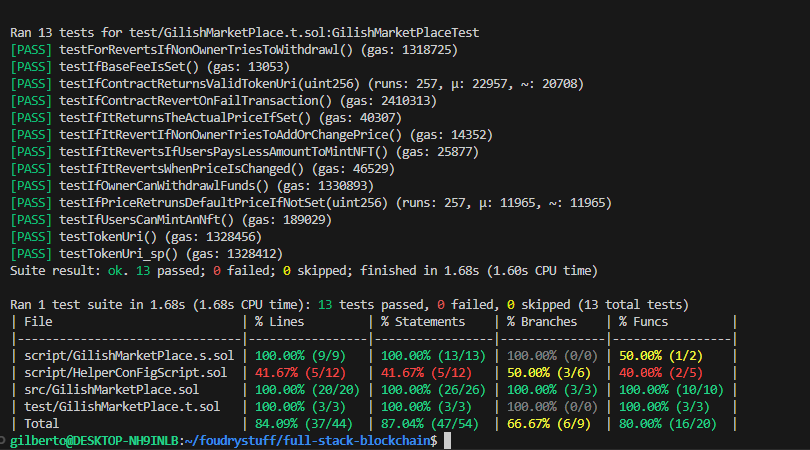

# Gilish Market Smart Contract

```
  ____ _ _ _     _     _               __  __             _            
 / ___(_) | |_  (_)___| |_ _ __ ___   |  \/  | __ _ _ __ (_)_ __   __ _ 
| |  _| | | __| | / __| __| '__/ _ \  | |\/| |/ _` | '_ \| | '_ \ / _` |
| |_| | | | |_  | \__ \ |_| | | (_) | | |  | | (_| | | | | | | | | (_| |
 \____|_|_|\__| |_|___/\__|_|  \___/  |_|  |_|\__,_|_| |_|_|_| |_|\__, |
                                                                  |___/ 
```

## Overview

The **Gilish Market Smart Contract** is the backbone of the blockchain functionality for the Gilish Market platform. It is written in **Solidity** and deployed on the **Sepolia Testnet**, enabling decentralized and secure interactions for users.

The smart contract provides the following functionalities:

- **NFT Minting and Metadata Management:** Users can mint NFTs with metadata stored off-chain.
- **Marketplace Operations:** Facilitates listing, buying, and selling of NFTs.
- **Ownership Verification and Access Control:** Ensures secure and transparent transactions.

---

## How to Use

### Build the Project
To build the smart contract, use the following command:
```shell
$ forge build
```

### Run Tests
To test the smart contract functionalities, run:
```shell
$ forge test
```

### Deploy the Smart Contract
You can deploy the contract using:
```shell
$ forge install
$ forge compile
```
then use the following command to deploy directly:
```shell
$ make deploy
   or
$ forge script script/GilishMarketPlace.s.sol
```

---

## Project Coverage

Below is the project coverage screenshot:


---

## About Gilish Market

The **Gilish Market Smart Contract** is designed to offer a seamless blockchain marketplace where users can:

- **Mint NFTs**: Users can mint their own NFTs with associated metadata.
- **Buy NFTs**: Purchase NFTs securely and directly from the marketplace.
- **Sell NFTs**: List NFTs for sale with full control over pricing.

Built with security, transparency, and efficiency in mind, the **Gilish Market** is perfect for both technical and non-technical users looking to engage in blockchain commerce.

---

## License

This project is licensed under the [MIT License](LICENSE).
